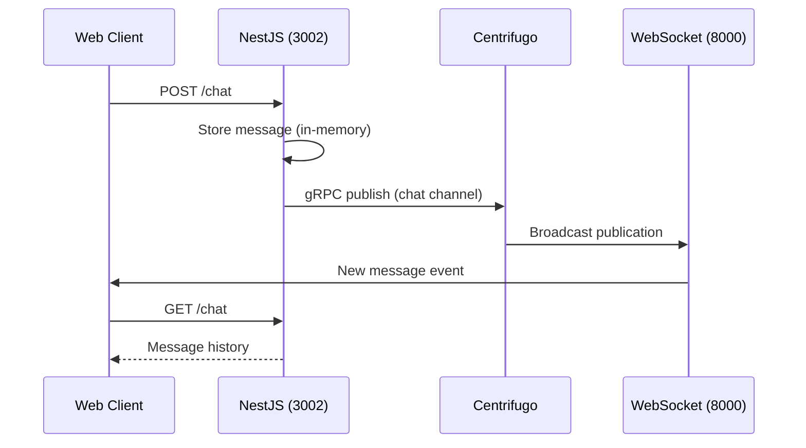

# ChatCore

A real-time chat application built as a Yarn monorepo. Messages are sent through a NestJS API, persisted in memory, and broadcast to all connected clients instantly via [Centrifugo](https://centrifugal.dev/).

## Features

- **Real-time delivery** — WebSocket subscriptions through Centrifugo
- **REST API** — Send and fetch messages over HTTP
- **CQRS backend** — NestJS with command/query separation for chat operations
- **Modern frontend** — React 19 + Vite with a responsive chat UI

## Architecture



| Component | Role | Default port |
|-----------|------|--------------|
| `apps/web` | React UI; proxies `/chat` to the API; connects to Centrifugo over WebSocket | 5173 |
| `apps/server` | NestJS API; stores messages and publishes to Centrifugo | 3002 |
| Centrifugo | Real-time broker; fans out messages to subscribers | 8000 (WS), 10000 (gRPC) |

## Tech stack

| Layer | Technologies |
|-------|--------------|
| Frontend | React, Vite, Centrifuge JS client |
| Backend | NestJS, @nestjs/cqrs, gRPC |
| Real-time | Centrifugo |
| Monorepo | Yarn 4 workspaces |

## Prerequisites

- **Node.js** 18+
- **Yarn** 4 (see `packageManager` in root `package.json`)
- **Docker** (recommended for Centrifugo) or a local Centrifugo binary

## Getting started

### 1. Install dependencies

```bash
yarn install
```

### 2. Start Centrifugo

The project includes a Centrifugo config at `centrifugo/config.json` with gRPC API enabled on port `10000` and client WebSocket on port `8000`.

**With Docker:**

```bash
docker run -it --rm \
  -p 8000:8000 \
  -p 10000:10000 \
  -v "$(pwd)/centrifugo/config.json:/centrifugo/config.json" \
  centrifugo/centrifugo:latest \
  centrifugo --config=/centrifugo/config.json
```

**With a local binary:**

```bash
centrifugo --config=centrifugo/config.json
```

### 3. Start the API server

```bash
yarn server
```

The NestJS server listens on **http://localhost:3002** (override with the `PORT` env var).

### 4. Start the web app

```bash
yarn web
```

Open **http://localhost:5173** in your browser. Open multiple tabs to see messages appear in real time.

## API

### `GET /chat`

Returns all messages stored on the server.

**Response:**

```json
[
  { "text": "Hello!", "createdAt": "2026-06-14T12:00:00.000Z" }
]
```

### `POST /chat`

Send a new message. The message is stored and published to the `chat` Centrifugo channel.

**Request body:**

```json
{ "message": "Hello!" }
```

**Response:**

```json
{ "message": "Message sent successfully" }
```

## Project structure

```
ChatCore/
├── apps/
│   ├── server/          # NestJS API
│   │   └── src/
│   │       ├── chat/    # Chat module (controller, CQRS handlers, repository)
│   │       └── centrifugo/  # gRPC client for Centrifugo publish API
│   └── web/             # React + Vite frontend
│       └── src/
│           └── App.tsx  # Chat UI and Centrifugo subscription
├── centrifugo/
│   └── config.json      # Centrifugo server configuration
└── package.json         # Workspace root scripts
```

## Configuration

### Centrifugo (`centrifugo/config.json`)

- **gRPC API** — port `10000`, key `api_key` (used by the NestJS server)
- **Client WebSocket** — port `8000`, insecure mode for local development
- **Admin UI** — enabled with password `admin` / secret `secret`

The NestJS `CentrifugoService` connects to `localhost:10000` and authenticates with `apikey api_key`. Keep these values aligned if you change the config.

### Vite proxy (`apps/web/vite.config.ts`)

During development, requests to `/chat` are proxied to `http://localhost:3002`.

### Environment variables

| Variable | Default | Description |
|----------|---------|-------------|
| `PORT` | `3002` | NestJS server port |

## Scripts

| Command | Description |
|---------|-------------|
| `yarn server` | Start NestJS in watch mode |
| `yarn web` | Start Vite dev server |

Workspace-specific scripts (run from root with `yarn workspace <name> <script>`):

| Workspace | Script | Description |
|-----------|--------|-------------|
| `server` | `build` | Compile NestJS to `dist/` |
| `server` | `start:prod` | Run compiled server |
| `server` | `test` | Run unit tests |
| `web` | `build` | Production build |
| `web` | `preview` | Preview production build |

## Development notes

- **Message storage** is in-memory (`ChatRepository`). Messages are lost when the server restarts.
- **No authentication** — the app is intended for local development and demos.
- The web client subscribes to the `chat` channel without a JWT because Centrifugo runs in insecure client mode locally.

## License

UNLICENSED (see individual app `package.json` files).
